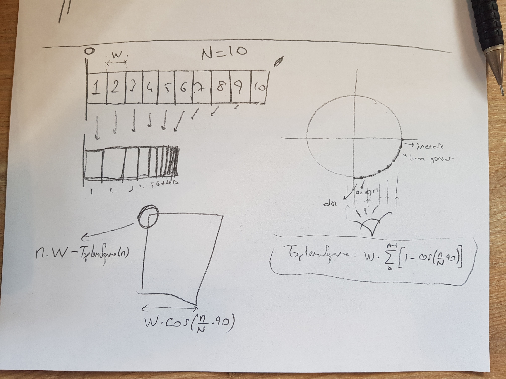

# SilindireSar
Düz şerit biçimindeki resmi silindirin bir yüzüne sar.

## Şu an 90 derecelik kısmı sarıyor.


p5js kodu::
```

  function setup() {
  createCanvas(600, 400);
  
  background(220);
  translate(0, height/2);
  let N = 15;
  let W = 20;
  let da = Math.PI/2/N;
  
  for (let n = 0; n <= N; n++){
    fill(100);
    rect(n*W - ToplamSapma(n,N,W),-20, W*Math.cos(n*da), 40);
     console.log(n);
  }

}

/*
function ToplamSapma(n, N, W) {
  let toplam = 0;
  let da = Math.PI/4/N;
  for (let i = 0; i < n; i++){
    toplam += Math.cos(i*da)
  }
  let fark = (n-1)*n/2 - toplam;
  console.log(n + " değeri için toplam sapma " + W*fark);
  return W*fark;
}*/
/*
function ToplamSapma(n, N, W) {
  let toplam = 0;
  let da = Math.PI/4/N;
  for (let i = 0; i < n; i++){
    toplam += 1 - Math.cos(i*da);
  }
  console.log(n + " değeri için toplam sapma " + W*toplam);
  return W*toplam;
}*/

function ToplamSapma(n, N, W) {
  let toplam = 0;
  let da = Math.PI/2/N;
  for (let i = 0; i < n; i++){
    toplam += Math.cos(i*da)
  }
  let fark = (n-1) - toplam;
  // console.log(n + " değeri için toplam sapma " + W*fark);
  return W*fark;
}
```
